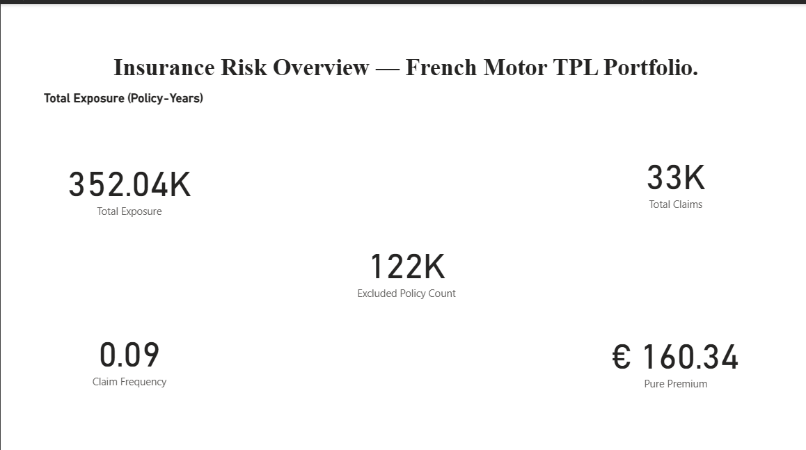
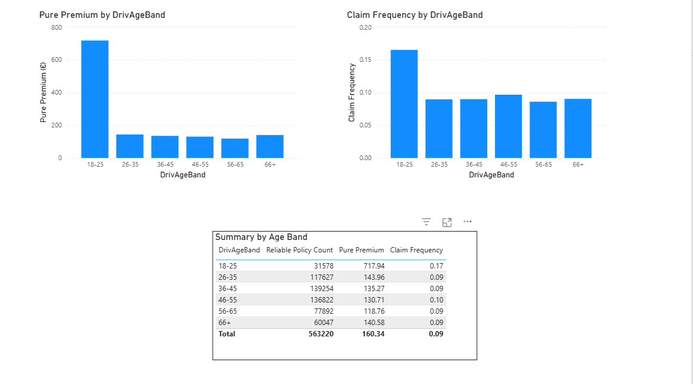
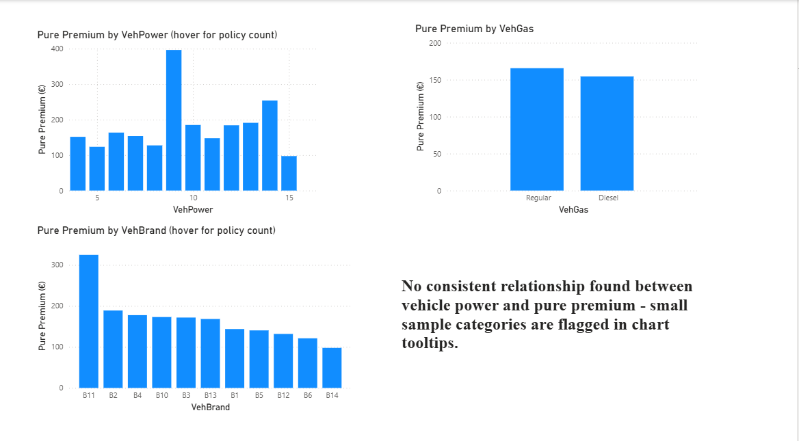
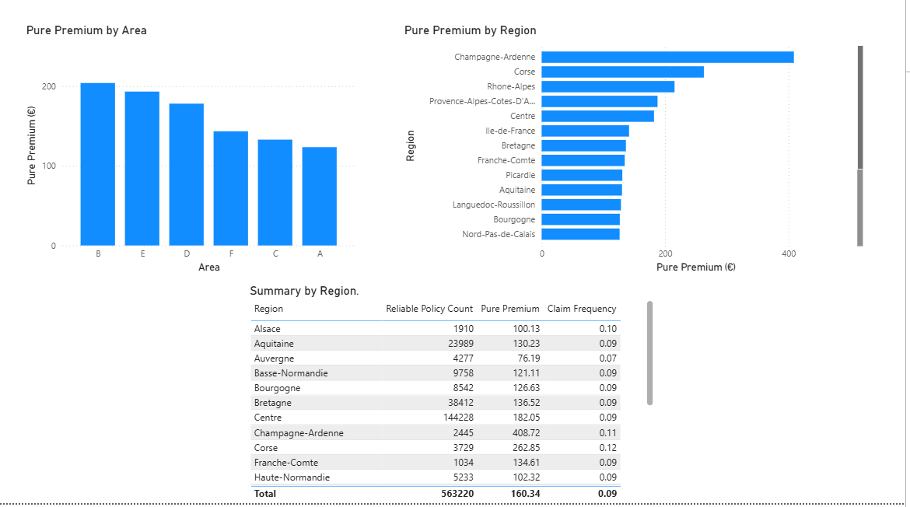
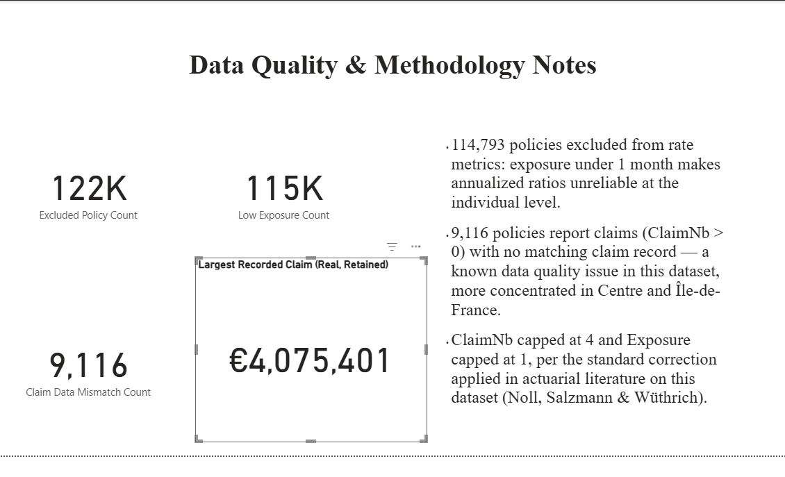

# insurance-analytics
Risk segmentation and pure premium analysis on 678,013 real French motor insurance policies, using Python and Power BI

# Insurance Risk Analytics 🚗

## Problem Statement
Insurers price risk by segment, not by treating every policyholder identically — but doing that correctly requires clean exposure data, since claim frequency and severity are only meaningful when measured per unit of time at risk. This project analyzes 678,013 real French motor third-party liability (TPL) policies and 26,639 associated claims to compute pure premium (expected claim cost per policy-year) across driver age, vehicle, and geographic segments, while explicitly handling two real data-quality issues present in the source data rather than treating the raw numbers as trustworthy by default.

## Objectives
- Merge policy-level exposure data with claim-level severity data into a single enriched dataset
- Identify and correct known data-quality issues in the dataset: impossible exposure/claim values, and policies reporting claims with no matching claim record
- Compute claim frequency, severity, and pure premium at the portfolio level, correctly aggregated rather than read at the individual-policy level (which is statistically unreliable for rare events)
- Segment risk by driver age, vehicle characteristics (power, brand, fuel type), and geography (region, area)
- Flag low-reliability segments (small sample sizes) directly in the dashboard rather than letting a small sample look as trustworthy as a large one
- Build an interactive Power BI dashboard with DAX measures, not static pre-computed charts

## Tools Used
- **Python** (Pandas) — Data merging, cleaning, outlier investigation, and feature engineering (claim frequency, severity, pure premium, exposure/claim caps)
- **Power BI** — Data model, DAX measures (frequency/severity/premium calculations with reliability filtering built in), and the interactive dashboard as the final deliverable

## Dataset
[freMTPL2 — French Motor Third-Party Liability Claims](https://www.openml.org/search?type=data&sort=runs&id=41214) — real, anonymized policy-level data used in academic actuarial science (referenced in *Computational Actuarial Science with R* and the Noll, Salzmann & Wüthrich case study on this exact dataset), covering ~2011–2013
- `freMTPL2freq.csv` — 678,013 policies with risk features (driver age, vehicle age/power, bonus-malus, region, fuel type, exposure)
- `freMTPL2sev.csv` — 26,639 individual claim records with claim amounts, linked to policies via `IDpol` (one policy can have multiple claims)

## Data Quality Issues Found and Handled
This dataset has two documented real-world data issues, which this project treats as findings to disclose rather than errors to silently patch:
- **9,116 policies (1.3%)** report a nonzero claim count with no matching claim record in the severity file — a known gap in this dataset. These are flagged (`HasClaimDataIssue`) and excluded from pure premium calculations, though kept visible in the exported data. The gap is not evenly distributed — it's moderately concentrated in Centre and Île-de-France.
- **114,793 policies (16.9%)** have exposure under 1 month. Per-policy ratios (claim frequency, pure premium) are mathematically unstable at this scale — a policy observed for a few days that happens to have one claim will show an absurd annualized rate. These are excluded from all rate-based metrics (`LowExposureFlag`) and reporting is done at the segment level, not per-policy, for this reason.
- Per the standard correction applied in actuarial literature on this dataset, `ClaimNb` is capped at 4 and `Exposure` is capped at 1 (both had a small number of physically impossible values in the raw data).
- One legitimate outlier was identified and deliberately retained: a single real claim of €4,075,401 — confirmed against the raw claims file as a genuine catastrophic liability payout, not a data error.

## Key Findings
- Pure premium follows a **U-shape by driver age**, not a simple "young drivers cost more" story: 18–25 has by far the highest pure premium (€717.94) and claim frequency (0.17), both drop through the 30s–50s, hit their lowest point at 56–65 (€118.76), then tick back up slightly at 66+ (€140.58).
- **No consistent relationship between vehicle power and pure premium** — the data doesn't support a "more powerful vehicle = costlier to insure" narrative; several of the highest and lowest pure-premium VehPower categories both sit on small sample sizes (1,000–2,600 policies), which the dashboard flags directly.
- **Area shows a cleaner gradient than Region**: Area B has the highest pure premium (€203.95), Area A the lowest (€123.37), with large sample sizes throughout (60K+ policies per category) — a more reliable pattern than the regional breakdown.
- Regional pure premium is dominated by small-sample noise at the top: Champagne-Ardenne shows the highest pure premium (€408.72) but has only 2,445 reliable policies — the largest, most reliable regions (Centre, 144,228 policies; Île-de-France, 55,638) sit in the unremarkable middle of the range (€182.05 and €141.64 respectively).

## Project Structure
insurance-analytics/
├── README.md
├── notebooks/
│ └── insurance-analysis.ipynb
├── powerbi/
│ └── insurance_dashboard.pbix
└── images/
├── dashboard_overview.png
├── dashboard_demographics.png
├── dashboard_vehicle.png
├── dashboard_geography.png
└── dashboard_data_quality.png

## Dashboard Contents
- **Overview** — Portfolio-level KPIs: total exposure, total claims, claim frequency, pure premium, and excluded policy count shown up front, not hidden

  

- **Risk by Demographics** — Pure premium and claim frequency by driver age band

  

- **Risk by Vehicle** — Pure premium by vehicle power, brand, and fuel type, with policy-count tooltips on the noisier segments

  

- **Risk by Geography** — Pure premium by region and area, with a summary table showing reliable policy count alongside every figure

  

- **Data Quality & Methodology Notes** — The exclusion counts and correction methodology, made visible in the dashboard itself rather than left only in this README

  
